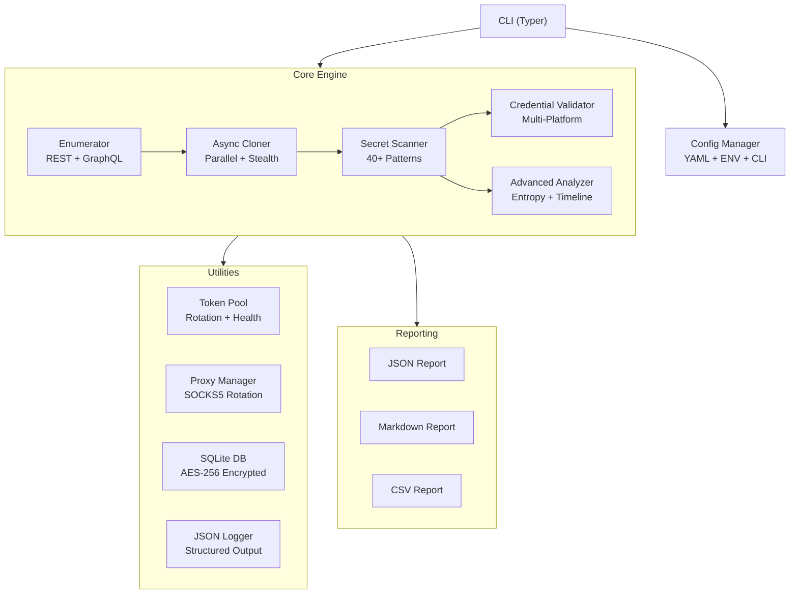

# GHRecon — GitHub Secret Reconnaissance Engine

**Production-grade offensive security tool** for automated GitHub organization/user reconnaissance with credential extraction, validation, and stealth operation.

## Architecture Overview



## Project Structure

| File | Size | Purpose |
|------|------|---------|
| [ghrecon.py](file:///d:/Secret-Hunter/ghrecon.py) | Entry | Main CLI entry point |
| [config.yaml](file:///d:/Secret-Hunter/config.yaml) | Config | Default configuration |
| [requirements.txt](file:///d:/Secret-Hunter/requirements.txt) | Deps | Python dependencies |
| [cli.py](file:///d:/Secret-Hunter/ghrecon/cli.py) | 20KB | Typer CLI with Rich output |
| [config.py](file:///d:/Secret-Hunter/ghrecon/config.py) | 7KB | Pydantic config management |
| [enumerator.py](file:///d:/Secret-Hunter/ghrecon/core/enumerator.py) | 18KB | GitHub REST + GraphQL enumeration |
| [cloner.py](file:///d:/Secret-Hunter/ghrecon/core/cloner.py) | 12KB | Async git operations |
| [scanner.py](file:///d:/Secret-Hunter/ghrecon/core/scanner.py) | 18KB | Secret detection (40 patterns) |
| [validator.py](file:///d:/Secret-Hunter/ghrecon/core/validator.py) | 5KB | Validation orchestrator |
| [analyzer.py](file:///d:/Secret-Hunter/ghrecon/core/analyzer.py) | 13KB | Timeline, deps, CI/CD analysis |
| [aws.py](file:///d:/Secret-Hunter/ghrecon/validators/aws.py) | 6KB | AWS STS validation |
| [github_val.py](file:///d:/Secret-Hunter/ghrecon/validators/github_val.py) | 4KB | GitHub token validation |
| [slack.py](file:///d:/Secret-Hunter/ghrecon/validators/slack.py) | 2KB | Slack auth.test validation |
| [google.py](file:///d:/Secret-Hunter/ghrecon/validators/google.py) | 2KB | Google API key validation |
| [stripe.py](file:///d:/Secret-Hunter/ghrecon/validators/stripe.py) | 2KB | Stripe balance validation |
| [openai_val.py](file:///d:/Secret-Hunter/ghrecon/validators/openai_val.py) | 2KB | OpenAI models validation |
| [db.py](file:///d:/Secret-Hunter/ghrecon/utils/db.py) | 16KB | SQLite with AES-256 encryption |
| [token_pool.py](file:///d:/Secret-Hunter/ghrecon/utils/token_pool.py) | 5KB | Token rotation + health |
| [proxy.py](file:///d:/Secret-Hunter/ghrecon/utils/proxy.py) | 3KB | SOCKS5 proxy rotation |
| [logger.py](file:///d:/Secret-Hunter/ghrecon/utils/logger.py) | 3KB | Structured JSON logging |
| [secrets.yaml](file:///d:/Secret-Hunter/ghrecon/patterns/secrets.yaml) | 2KB | Pattern definitions |
| [json_report.py](file:///d:/Secret-Hunter/ghrecon/reporting/json_report.py) | 5KB | JSON report generator |
| [markdown_report.py](file:///d:/Secret-Hunter/ghrecon/reporting/markdown_report.py) | 8KB | Markdown report generator |
| [csv_report.py](file:///d:/Secret-Hunter/ghrecon/reporting/csv_report.py) | 2KB | CSV report generator |

## Usage Examples

```bash
# Basic scan
python ghrecon.py scan myorg

# Full options
python ghrecon.py scan myorg \
    --tokens tokens.txt \
    --parallel 12 \
    --depth shallow \
    --validate-secrets \
    --scan-branches \
    --scan-actions \
    --skip-forks \
    --skip-archived \
    --max-size 500 \
    --stealth \
    --proxy-list proxies.txt \
    --output-format json,markdown,csv \
    --output-dir ./scans/myorg

# Search-based
python ghrecon.py scan --type search "org:google language:python stars:>1000" --max-repos 50

# Resume interrupted
python ghrecon.py scan myorg --resume-scan 20250422_143522_myorg

# Export validated only
python ghrecon.py export 20250422_143522_myorg --validated-only --format json

# Check status
python ghrecon.py status
```

## Key Features Implemented

### Secret Detection (40 patterns)
- **Cloud**: AWS Access/Secret Keys, Azure Storage, GCP Service Accounts
- **VCS**: GitHub PAT/OAuth/App/Refresh tokens
- **Comms**: Slack tokens/webhooks, Discord, Telegram bots
- **Payment**: Stripe live/restricted keys, Square tokens
- **AI/ML**: OpenAI API keys
- **Email**: SendGrid, Mailgun, Twilio
- **Infra**: Private keys, JWTs, connection strings, passwords
- **Package Registries**: NPM, PyPI tokens
- **Platform**: Heroku, Shopify, Databricks, DigitalOcean
- **High-entropy strings** near sensitive keywords (Shannon entropy > 4.5)

### Validation (6 platforms)
- **AWS**: STS GetCallerIdentity (read-only, minimal CloudTrail)
- **GitHub**: /user endpoint + scope enumeration + org discovery
- **Slack**: auth.test with workspace enumeration
- **Google**: API key validity check
- **Stripe**: /v1/balance read-only check
- **OpenAI**: /v1/models endpoint

### Stealth Operations
- Jittered delays (configurable 3-15s)
- SOCKS5 proxy rotation
- User-Agent randomization
- Randomized clone order
- Token rotation with health tracking

### Data Security
- AES-256 encrypted secret storage in SQLite
- `--no-store-secrets` flag (hash-only mode)
- Automatic repo cleanup after scan
- SHA-256 deduplication

### Resilience
- Interrupted scan resume via `--resume-scan`
- Token auto-rotation on rate limit/expiry
- Exponential backoff on failures
- Disk space checks before cloning
- Graceful error handling throughout
